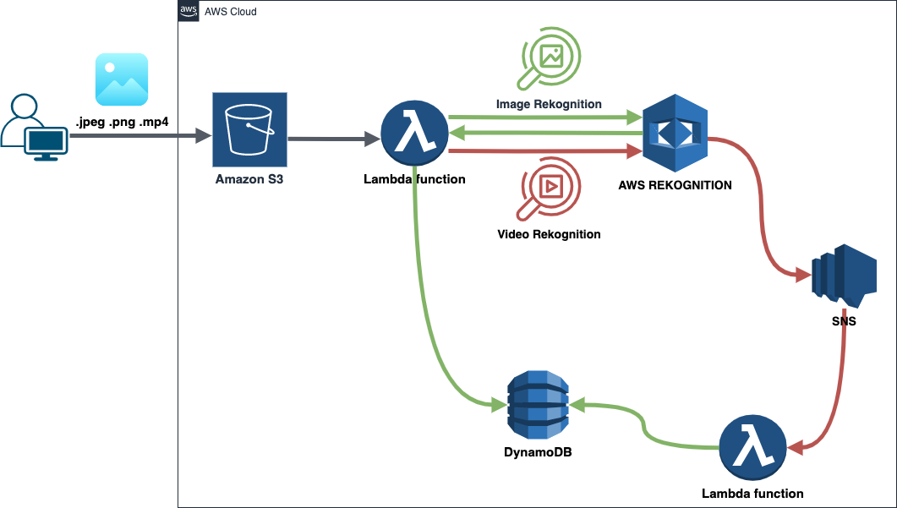

<br />
<div align="center">
  <h3 align="center">Project 2</h3>
  <p align="center">
    Analyse videos/images with AWS Recognition.
    <br />
  </p>
</div>


<!-- ABOUT THE PROJECT -->
## Project Structure



<!-- GETTING STARTED -->
## Getting Started

### Look for LabRole ARN and update the
`configuration.json`

### Install ServerLess framework

We need to install serverless framework.

  ```sh
  npm install serverless
  ```
### Check `credentials.json` key value pairs and set yours in repl __SECRETS__.

### Deploy your function
Move to `/rekognition` folder

```sh
cd ./rekognition
```

Run
```sh
../node_modules/.bin/serverless deploy
```
